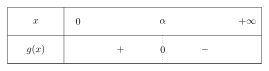

# Exemples provenant des cours de mathématiques de terminal rendu interractif.

La documentation Markdown, se trouve ici:

https://www.markdownguide.org/getting-started/

## Reproduire un exemple de maths

Dans le dossier `.../data/maths/` créer le dossier du Chapitre si ce n'est pas déjà fait. Sous ce format là: `Chapter_X`, `X` étant le numéro du chapitre.

Ensuite créer un fichier avec l'extension `.md` et qui a pour nom `exemple_X`, `X` étant le numéro de l'exemple.

### Dans le dossier il faut mettre un titre, sous cette forme:

```md
# Exemple X - Type BAC ou Type DS ou rien
```

### Les consignes sont formatées sous cette forme:

```md
1. Ceci est la consigne.

   a) Ceci est une sous-consigne.
```

### Les réponses doivent être cachées, pour cela:

```md
<section class="hidden">

Voici ma réponse.

</section>
```

> En markdown, il est important à noter que pour avoir un saut de ligne il faut faire deux saut de lignes (dans le fichier .md, comme le montre l'exemple ci-dessus), sinon il ne sera pas comptabilisé comme tel, et pourra mener à des erreurs.

### Pour tout ce qui est de la litérature mathématiques.

Nous suivons le formatage LaTeX, seulement étant donner que nos fichiers sont sur un site internet, il faut utiliser un interpréteur qui transformera les expressions mathématiques correctement une fois la page chargée, deux interpréteurs existent, MathJax et KaTeX. Nous utilisons KaTeX.

Dans le ficier markdown, nous avons deux manières d'exprimer une expression mathématique:

```md
Ceci est une expression mathématiques en LaTeX: $E = mc²$.
```

Ce qui donne:

Ceci est une exepression mathématique en LaTeX: $E = mc²$.

On appelle ça une expression <i>inline</i>.

La manière suivante:

```md
Ceci est une expression mathématique en LaTeX:

$$
E = mc²
$$
```

Ce qui donne:

Ceci est une expression mathématique en LaTeX:

$$
E = mc²
$$

On appelle ça une expression <i>display</i>, elle a l'avantage de pouvoir continuer sur plusieurs lignes, et d'être centrée.

Voici la documentation [KaTeX](https://katex.org/docs/supported.html)

### Ajouter des images

Il est possible que des fois il faille rajouter des images dans l'exemple, pour cela, ajoutez votre image dans dans le même dossier que votre exemple, renommer l'image sous ce format:

`exemple_x_n.ext`

> `x` correspond au numéro de l'exemple, `n` correspond au numéro de l'image, si c'est la première image que vous rajoutez, son numéro sera 1. Et `ext` correspond à l'extension de votre image (`png`, `jpg`, `svg`).

Pour lier l'image à votre exemple_x.md:

```md
...

<center>



</center>

...
```

Ce qui donne:

<center>


</center>

### Transfomer le fichier Markdown en fichier HTML.

Pour cela on utilise un programme nommé [pandoc](https://pandoc.org/installing.html).

Il suffit de simplement écrire cette commande dans votre terminal:

```bash
pandoc --from markdown --to html5 --mathjax  .../Chapter_X/exemple_x.md  -o .../Chapter_X/exemple_x.html
```

> Il faut évidemment modifier `.../Chapter_X/exemple_x.md` et `.../Chapter_X/exemple_x.html` aux chemins qui correspondent à votre exemple.

### Ajouter l'exemple à la base de données.

Une des manières est de se connecter à `phpmyadmin`.

Puis il faut ajouter le chapitre dans la table des chapitres, si ce n'est pas déjà fait.

Ensuite il faut ajouter l'exemple à la table des exemple avec le chemin entier qui pointe vers l'exemple_x.html
